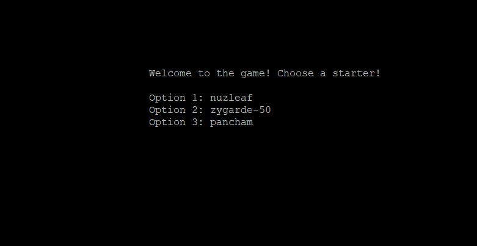
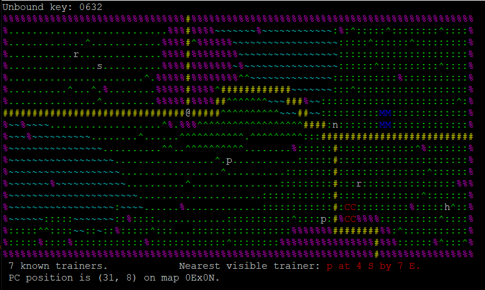
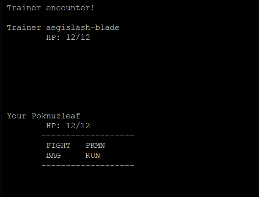

# pokemonGame

COMS327 Assignment-1.01 Terrain Generation
use "make all" run the program

Assignment-1.02 Map to Map
Move around a 401 by 401 array of maps
A random map is generated when new location is visited 
The exists of map align with maps around it

use "make all" run the program

Move in the map using inputs:- n,s,e,w,f,q
Map begins in the center (0,0)

Assignment-1.03 Path Finding

Calculating shortest path for rival and hiker trainers using Dijkstra's algorithm
Program displays the hiker and rival distance maps

Use "make all" to complie 
Use "./poke327" to start 

Assignment-1.04 Player Character and Trainers

Added the player character and other Pokemon trainers
--numtrainers: that takes an integer count of the number of trainers to scatter around

Use "make all" to complie 
Use "./poke327" or "./poke327 --numtrainers <integers> to start

Assignment-1.05 User Interface

User can move the player character (@), enter building, display trainer list
Assigning color to the terrains and setting pokemon battle interface

Use "make all" to complie 
Use "./poke327" or "./poke327 --numtrainers <integers> to start

Assignment-1.06 Moving to Neighboring Maps and Porting to C++

Player Character can now traverse map to map through gates or fly using 'f' and the code is now ported to C++

Use "make all" to complie 
Use "./poke327" or "./poke327 --numtrainers <integers> to start

Assignment-1.07 CSV parsing

Data parses from 9 different CSV files (pokemon.csv, moves.csv, pokemon moves.csv, pokemon species.csv,
experience.csv, type names.csv, pokemon stats.csv, stats.csv, pokemon types.csv) and prints out information

Use "make all" to complie 
Use "./poke327" or "./poke327 <data>" to start

Assignment-1.08 Loading Pokemon

Load pokemon in the game and ability to encounter them.
10% probability of encouring pokemon in tall grass.

Use "make all" to complie 
Use "./poke327" to start

Assignment-1.09 Pokemon Battles

Player character will now be able to battle other trainers and encounter wild pokemons.

Use "make all" to complie 
Use "./poke327" to start

Final Game Screenshots

